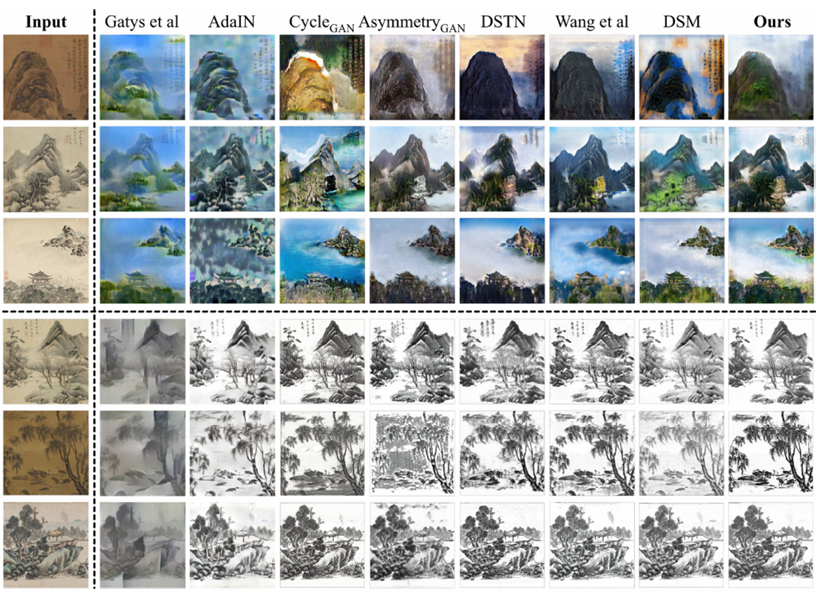

# Unofficial DLP-GAN Implementation
Unofficial PyTorch implementation of [DLP-GAN: learning to draw modern Chinese landscape photos with generative adversarial network](https://arxiv.org/abs/2403.03456)

For the official implementation, please refer to the original paper.



## Installation

```bash
# Clone this repo
git clone https://github.com/injea/AncientPainitng2NaturalImage.git
cd AncientPainitng2NaturalImage

# Install dependencies
pip install -r requirements.txt
```

## Dataset

Since the original DLP-GAN paper doesn't provide the exact dataset used, we use modern landscape photos from LHQ-1024 dataset for training. This is an unofficial implementation and may differ from the original paper's implementation.

### Manual Download
- Download datasets (e.g. CBP, CFP) : https://drive.google.com/open?id=1ilqfMC3A9Kt6CaoZZCT9tI-wWRl1kLFB
- Chinese Landscape Painting Dataset : https://github.com/alicex2020/Chinese-Landscape-Painting-Dataset
- LHQ-1024 (Modern landscape photos) : https://www.kaggle.com/datasets/dimensi0n/lhq-1024

### Automatic Download (Recommended)
You can automatically download all datasets using our built-in downloader:

```bash
# Download all datasets at once
python util/get_data.py

# Or download specific datasets
python -c "
from util.get_data import GetData
gd = GetData()

# Download DLP-GAN dataset (Chinese landscape paintings)
gd.get_dlp_gan_dataset('./datasets/dlp_gan_dataset')

# Download DSTN datasets (Bird, Flower, Landscape)
gd.get_dstn_dataset('./datasets/dstn_dataset')

# Download LHQ-1024 dataset (Modern landscape photos)
gd.get_lhq_1024_dataset('./datasets/lhq_1024')
"
```

The datasets will be automatically organized in the `./datasets/` directory with the proper structure for training.

## Citation

```bash
@article{gui2023dlp,
  title        = {DLP-GAN: Learning to Draw Modern Chinese Landscape Photos with Generative Adversarial Network},
  author       = {Gui, Xiangquan and Zhang, Binxuan and Li, Li and Yang, Yi},
  journal      = {Neural Computing and Applications},
  pages        = {1--18},
  year         = {2023},
  publisher    = {Springer},
  doi          = {10.1007/s00521-023-09345-8}
}
```
## Acknowledgments
Code is inspired by [AncientPainitng2NaturalImage](https://github.com/qiaott/AncientPainitng2NaturalImage).

## Notice

⚠️ **Important Implementation Fix**: The original AncientPainitng2NaturalImage repository has a critical bug in VGG input processing. It subtracts ImageNet mean values `[103.939, 116.779, 123.680]` from images that are already normalized to the `-1~1` scale, resulting in input images with a problematic `-130~-100` scale range being fed into the VGG network.

In this implementation, I have replaced the VGG model with PyTorch's pretrained VGG and fixed this scaling issue. Please be aware of this difference when comparing results.

